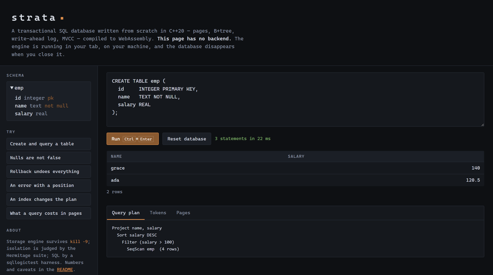

<h1 align="center">strata</h1>

<p align="center">
  <b>A transactional SQL database written from scratch in C++20.</b><br>
  Pages, B+tree, write-ahead log, MVCC, parser, executor — and a browser
  playground, because it compiles to WebAssembly.
</p>

<p align="center">
  
  
  
  
  
  
</p>

<p align="center">
  <a href="#quick-start">Quick start</a> ·
  <a href="#walkthrough">Walkthrough</a> ·
  <a href="#how-it-works">How it works</a> ·
  <a href="#correctness">Correctness</a> ·
  <a href="#benchmarks">Benchmarks</a>
</p>

<p align="center">
  
</p>

---

## What this is

A database, built one layer at a time, where **every correctness claim is
checked by a test suite somebody else wrote.**

Anyone can write a database that passes its own tests. Strata's isolation level
is judged by [**Hermitage**](https://github.com/ept/hermitage), which defines
the concrete anomalies each level must prevent. Its SQL runs under a
**sqllogictest** harness in SQLite's own format. Its crash safety is measured by
killing the process with `taskkill /F` in a loop and checking that every
acknowledged write came back.

It is about 9,600 lines of C++ with no database dependencies — the B+tree, the
pager, the write-ahead log, the parser and the executor are all here.

> **Status: 6½ of 7 stages complete.** Everything below works and is tested.
> The half is a public URL for the playground — it builds and runs, it just
> isn't deployed yet.

---

## Quick start

**Requires** CMake 3.20+, a C++20 compiler, and
[vcpkg](https://github.com/microsoft/vcpkg) for GoogleTest, Google Benchmark
and SQLite.

```bash
git clone https://github.com/codecommander03/strata.git
cd strata

cmake -S . -B build -DCMAKE_TOOLCHAIN_FILE=$VCPKG_ROOT/scripts/buildsystems/vcpkg.cmake
cmake --build build --config Debug

./build/Debug/strata_shell          # an interactive SQL shell
```

```sql
strata> CREATE TABLE emp (id INTEGER PRIMARY KEY, name TEXT NOT NULL, salary REAL);
ok
strata> INSERT INTO emp VALUES (1,'ada',120.5), (2,'grace',140.0), (3,'alan',99.25);
ok (3 rows)
strata> SELECT name, salary FROM emp WHERE salary > 100 ORDER BY salary DESC;
+-------+--------+
| name  | salary |
+-------+--------+
| grace | 140    |
| ada   | 120.5  |
+-------+--------+
2 rows
```

---

## Walkthrough

### 1. See what the planner is doing

`.plan ON` prints the query plan above every result. Plans are pull-based, so
a `LIMIT` stops the operators above the scan rather than trimming a finished
result.

```
strata> .plan ON
plan on
strata> SELECT name, salary FROM emp WHERE salary > 100 ORDER BY salary DESC;
Project name, salary
  Sort salary DESC
    Filter (salary > 100)
      SeqScan emp  (3 rows)
```

### 2. Nulls are not false

SQL's three-valued logic is implemented properly, which is the part most
hand-rolled engines get wrong. `NULL = NULL` is *unknown*, and `WHERE` keeps
only rows that are definitely true.

```sql
strata> INSERT INTO emp VALUES (4, 'edsger', NULL);
ok (1 rows)
strata> SELECT name FROM emp WHERE salary > 100;     -- edsger is dropped
strata> SELECT name FROM emp WHERE salary = NULL;    -- so is everyone
strata> SELECT name FROM emp WHERE salary IS NULL;   -- this finds him
```

`1 / 0` returns `NULL` rather than raising, matching SQLite — a deliberate
choice recorded in [decision 016](docs/DECISIONS.md).

### 3. Transactions actually roll back

```sql
strata> BEGIN;
strata> UPDATE emp SET salary = 0;
ok (4 rows)
strata> ROLLBACK;
strata> SELECT salary FROM emp WHERE name = 'ada';   -- still 120.5
```

Uncommitted writes never enter the B+tree at all — they live in the
transaction's own buffer until commit. That makes a dirty read not merely
prevented but *unrepresentable*
([decision 012](docs/DECISIONS.md)).

### 4. Errors point at the mistake

Every parse error carries the line and column of the **offending token**, not
of wherever the parser had reached.

```
strata> SELECT * FROM emp WHERE;
error: InvalidArgument: 1:24: expected a value, a column name or '(', found ';'
strata> UPDATE emp x = 1;
error: InvalidArgument: 1:12: expected SET, found identifier 'x'
strata> SELECT 'oops;
error: InvalidArgument: 1:8: unterminated string literal
```

That last one reports the *opening* quote, not end-of-input — the difference
between a usable message and a useless one in a long statement.

### 5. Add an index and watch the plan change

```
strata> CREATE INDEX idx_salary ON emp(salary);
ok
strata> SELECT name FROM emp WHERE salary = 140;
Project name
  Filter (salary = 140)
    IndexScan idx_salary on emp  (seek, 1 of 1 candidates fetched)
```

The planner recognises `column = literal` against an indexed column and seeks
instead of scanning — one row off the heap instead of the whole table. On a
thousand rows that is **80× faster** (1,205 µs → 15.0 µs).

Note the `Filter` is still there. The index narrows the candidates; the
predicate still decides. That way an encoding collision costs a wasted row
fetch and never a wrong answer ([decision 021](docs/DECISIONS.md)).

### 6. Kill it mid-write

The gate for the storage engine wasn't a unit test. It was a separate process
writing real transactions, killed by the operating system at random points:

```powershell
PS> .\scripts\chaos.ps1 -Kills 25 -Keys 30000 -Batch 200

  kill   1  killed          committed>=16000   ok keys=16000
  kill   2  killed          committed>=11200   ok keys=16000
  ...
  kill  25  killed          committed>=11000   ok keys=17000

PASSED
  25 of 25 runs recovered with every committed key intact
  high water mark: 16,800 keys
```

The writer prints `committed N` only **after** its commit fsync returns, so
that line is a lower bound on what recovery owes. After each kill the verifier
reopens the database, walks every tree invariant — page types, key order,
separator bounds, uniform leaf depth, and a sibling chain reaching exactly as
many keys as the tree claims — and then reads back every key to confirm its
value.

### 7. Run it in a browser

```powershell
PS> .\scripts\build_wasm.ps1 -Serve

  strata.js      62,240 bytes
  strata.wasm   288,907 bytes
  total         351,147 bytes (343 KB)
```

The playground in the screenshot above is a folder of five static files. **No
backend, no build step, nothing to pay for** — every visitor downloads 343 KB
once and runs their own database in their own tab. It shows the query plan, the
token stream, and how many pages each query touched.

First run needs the Emscripten SDK, which is free and needs no account:

```powershell
git clone https://github.com/emscripten-core/emsdk.git C:\emsdk
cd C:\emsdk; .\emsdk.bat install latest; .\emsdk.bat activate latest
```

`.github/workflows/pages.yml` publishes `web/` to GitHub Pages on every push
to `main`, and turns Pages on itself the first time it runs. The WebAssembly artifacts are committed rather than built in CI, so
that workflow **warns when `src/` or `include/` changed without
`web/strata.wasm` changing with them** — the case where the deployed page
would quietly serve an engine older than the source beside it. It warns rather
than blocks, because some engine changes compile to byte-identical output and
a check that rejects correct work gets bypassed.

---

## How it works

```
        ┌──────────────────────────────────────────────┐
        │  web/          playground, WebAssembly       │  stage 5
        ├──────────────────────────────────────────────┤
        │  Executor      SeqScan IndexScan Filter     │  stage 4
        │                Sort Project Limit — pull-    │  stage 7
        │                based iterators               │
        ├──────────────────────────────────────────────┤
        │  Parser        lexer, recursive descent,     │  stage 3
        │                precedence climbing, AST      │
        ├──────────────────────────────────────────────┤
        │  Database      MVCC, snapshots, first-       │  stage 2
        │  Transaction   committer-wins conflicts      │
        ├──────────────────────────────────────────────┤
        │  BTree         B+tree, sibling-chained       │  stage 1
        │  Pager         page cache, meta page         │
        │  Wal   File    chained checksums, fsync      │
        └──────────────────────────────────────────────┘
```

**Slotted pages.** Cell pointers grow forward from the 24-byte header, cell
content grows backward from the end of the 4 KiB page, and free space is the
gap between them — so "does this fit" is one subtraction.

**A B+tree.** Keys appear in internal pages only as separators; every key/value
pair lives in a leaf, and leaves are chained so a range scan touches no internal
page after the first descent. Splits propagate upward by return value rather
than by re-descending, so a cascading split is still one pass
([decision 006](docs/DECISIONS.md)).

**A write-ahead log.** Frame checksums chain through the whole log and every
frame carries a generation salt, so a stale frame left over from before a
checkpoint cannot be mistaken for a live one. A transaction's frames are staged
in memory and written in one burst at commit, so nothing uncommitted ever
reaches the file and recovery is a plain forward scan with no undo pass.

**MVCC.** Versions of a key are chained newest-first under a composite key, so
the visibility scan finds its answer on the first cell it looks at. Every
transaction id in the tree belongs to a committed transaction, which means
visibility needs no commit log on disk at all.

**One tree for everything.** The catalog lives in the same B+tree as the data,
under the same transaction. So `CREATE TABLE` rolls back with everything else,
and a reader with an old snapshot sees the schema that matches its data.

---

## Correctness

### Hermitage — isolation

All eight anomalies snapshot isolation must prevent are prevented:

| | |
|---|---|
| G0 dirty write | ✅ prevented |
| G1a dirty read | ✅ prevented |
| G1b intermediate read | ✅ prevented |
| G1c circular information flow | ✅ prevented |
| OTV observed transaction vanishes | ✅ prevented |
| PMP predicate many-preceders | ✅ prevented |
| P4 lost update | ✅ prevented |
| G-single read skew | ✅ prevented |
| **G2-item write skew** | ⚠️ **allowed — asserted to still occur** |
| **G2 anti-dependency cycle** | ⚠️ **allowed — asserted to still occur** |

The last two are the point. Snapshot isolation is *defined* by permitting write
skew; an engine that prevented it would not be better, it would be a different
isolation level and this table would be wrong. Those two tests fail if the
engine ever becomes accidentally stronger — which is the only way an
isolation-level claim stays honest over time.

### sqllogictest — SQL

```
statements 78/78   queries 85/85   total 163/163   unsupported 5
  unsupported: aggregate functions (COUNT, SUM, MIN, MAX) are not implemented
  unsupported: joins are not implemented
  unsupported: GROUP BY is not implemented
  unsupported: ORDER BY can only name a table column, not a projected alias
  unsupported: composite indexes need a tuple encoding and prefix-aware planning
```

**Read the caveat before quoting the number.** This is sqllogictest's *format*
run against a corpus written for this repository, **not** the official SQLite
corpus — that is several million statements distributed separately, exercising
far more SQL than this subset implements. The harness reads the real format so
a download can be pointed at it unchanged, but claiming a pass rate against a
suite that was never run would be exactly the dishonesty the external-judge idea
exists to prevent.

The four gaps are declared inside the test files and counted separately; they
inflate neither the numerator nor the denominator. Three further tests exist
only to prove the runner isn't vacuous — they feed it a wrong answer, a
statement that should have failed, and an unsupported block, and check it
notices each one.

```bash
./build/Debug/strata_tests                   # 132 tests
./build/Debug/strata_slt testdata/*.test     # the corpus on its own
./scripts/chaos.ps1 -Kills 25                # crash recovery
```

---

## Benchmarks

One machine — an AMD Ryzen 5 5600H laptop. **Absolute numbers from a laptop are
not comparable with anything measured anywhere else.** The ratios are the part
worth carrying away. SQLite 3.53.4 is configured with `journal_mode = WAL` and
`synchronous = FULL` to match strata's durability rather than run on its faster
defaults.

| | strata | SQLite | |
|---|---:|---:|---|
| Commit latency, one row per transaction | 2,212 µs | 2,062 µs | 1.07× slower |
| Bulk insert, 1,000 rows, one transaction | 13.6 ms | 9.50 ms | 1.4× slower |
| `SELECT … WHERE a = 500`, no index | 1,205 µs | 64.9 µs | 18.6× slower |
| `SELECT … WHERE a = 500`, **indexed** | **15.0 µs** | 11.7 µs | **1.28× slower** |
| `SELECT a FROM t`, whole table | 1,344 µs | 99.0 µs | 13.6× slower |

**Commit latency within 7% is the good news.** Both engines are waiting on the
same fsync, which says the write-ahead log is paying full price for durability
rather than quietly skipping one — the failure mode that makes a storage
benchmark look good and a database lose data.

**The 29× is the interesting news, and it is not the parser.** That needed
measuring rather than assuming, so two benchmarks exist only to rule
explanations out:

| | |
|---|---:|
| strata, parse the query and stop | 3.77 µs |
| SQLite, same query re-parsed every call | 70.4 µs |
| SQLite, same query prepared once | 72.4 µs |

Strata's parser is **0.2% of the query**. SQLite's prepared and re-parsed times
are within 3% of each other, so the API mismatch was never the unfair
comparison it looked like. What is left is
[decision 015](docs/DECISIONS.md): every scan materialises the whole table
before the first operator sees a row, so a `WHERE` matching one row pays for a
thousand — twice. That cost was written down *before* it was measured; the
benchmark just put a number on the prediction.

The raw B+tree is not the problem: point lookup goes from 791 ns at a thousand
keys to 1,630 ns at a hundred thousand — 100× the data for 2.1× the time — and
a full cursor scan runs at 15.3 M entries/second.

Full detail, the machine, and what is deliberately *not* measured:
[BENCHMARKS.md](BENCHMARKS.md).

---

## Two bugs worth knowing about

**A page came out of a split with half the cells and none of the space.**
`remove_cell` frees a cell's slot pointer but not its bytes, because reclaiming
them means moving every cell after it. So every insert into the left half of a
split page split again immediately. Sequential insertion never noticed — new
keys always land in the fresh right-hand page — and the 5,000-key test passed
happily. Random and reverse insertion failed instantly. The fix is `compact()`
plus a rule: any code path that concludes a page is full must compact and retry
before it believes itself. It is the whole argument for testing insertion
*orders* rather than insertion *counts*.

**`NOT` had the wrong precedence, and the tests agreed with it.** `NOT a > 2`
parsed as `(NOT a) > 2` instead of `NOT (a > 2)` — in SQL, `NOT` binds looser
than comparison. The parser's own unit test asserted the wrong shape, so the
implementation and its test suite were confidently, consistently wrong, and
every one of them was green. It took a query with a known-correct answer to
break the tie.

That is the argument for an external judge in one paragraph, and the reason
"run the real sqllogictest corpus" is the first item in
[FUTURE.md](docs/FUTURE.md).

---

## Project layout

```
strata/
├── include/strata/     public headers — page, pager, wal, btree, db, sql/
├── src/                implementation, mirroring include/
│   └── wasm/           the four C functions the browser calls
├── tests/              132 GoogleTest cases
├── bench/              Google Benchmark, against SQLite
├── tools/              shell, sqllogictest runner, crash harness
├── testdata/           the sqllogictest corpus
├── scripts/            chaos harness, wasm build
├── web/                the playground — five static files
└── docs/
    ├── PLAN.md         six stages, each gate and its evidence
    ├── DECISIONS.md    20 decisions, with alternatives and costs
    └── FUTURE.md       deliberately out of scope
```

## Not implemented

Named honestly rather than left to be discovered — the full list with reasoning
is in [FUTURE.md](docs/FUTURE.md).

- **Joins, aggregates, `GROUP BY`, subqueries.** The SQL subset is deliberately
  small.
- **Composite indexes.** One column per index; `CREATE INDEX i ON t(a, b)` is
  a parse error rather than a silent half-index.
- **Streaming scans.** A query with no usable index still materialises the
  whole table — which is why `SELECT a FROM t` is still 13.6× off SQLite while
  an indexed lookup is 1.28×.
- **Page-cache eviction.** The cache grows to the size of the database.
- **Freelist reuse and node merging.** Deleted space is never recycled.
- **Concurrency.** Single-threaded by design; "concurrent transactions" means
  several open at once in one thread, which is the shape Hermitage tests.
- **Serialisable isolation.** Snapshot isolation is the claim, and write skew
  is permitted.
- **Overflow pages.** A key plus value is capped at roughly 2 KB.

## Design decisions

Twenty of them in [DECISIONS.md](docs/DECISIONS.md), each with the alternatives
that lost and what the choice cost. A few that shaped everything else:

| # | Decision |
|---|---|
| 021 | An index narrows candidates; the predicate still decides |
| 023 | Index maintenance in the writing transaction, and drift is checkable |
| 002 | Write-ahead logging, not ARIES undo/redo |
| 004 | Deleting a cell orphans its bytes; space is reclaimed by compaction |
| 006 | Splits propagate by return value, not by re-descending |
| 008 | Errors are returned as `Status`, never thrown — which is what let the WASM build drop exceptions and RTTI |
| 012 | Uncommitted writes live in the transaction, not in the tree |
| 015 | Scans materialise instead of streaming — and what that cost |
| 017 | The sqllogictest corpus is written here, and this README says so |

## Licence

MIT — see [LICENSE](LICENSE).
